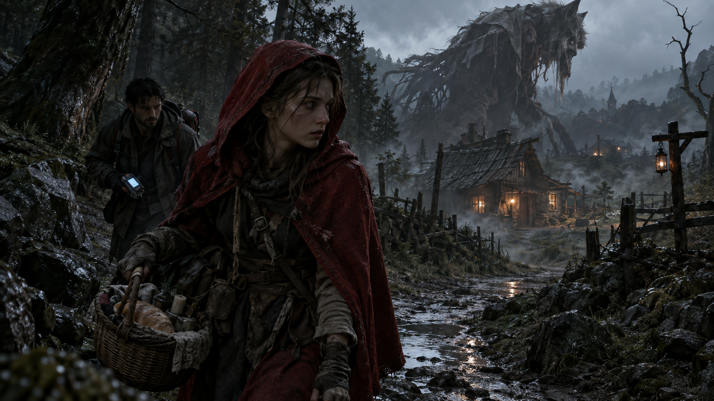

# ProjectX · 原创游戏内容策划作品集



> **一个世界观，三个能力维度：** 世界观构建 · 角色剧情设计 · 系统内容包装

**作者：** 万国桢 · 成都信息工程大学 · 2027 届
**方向：** 游戏内容策划 / 世界观文案（校招）

---

## 项目简介

《ProjectX》是我独立构建的原创多世界科幻世界观：人类发现的「X 物质」可重构为万物，却因「腐败」反噬文明；地球为延续自身，向其他世界采集稳定物质——而第一个到达的世界，正在上演小红帽的故事。

围绕该世界观，我完成了：

- **设定文档体系** —— X 物质规则、腐败危机、跨世界冲突
- **角色与剧情设计** —— 世界 001「小红帽」完整剧情线、角色设计、线索链
- **系统内容包装** —— SCAN / STABILIZE / FABRICATION / OVERDRIVE 功能设计与文案
- **两个可玩 Demo** —— Godot 4 开发，含完整 15–20 分钟叙事流程

---

## 核心文档（PDF）

| 文档 | 页数 | 说明 |
|------|------|------|
| [世界观与核心概念](01_世界观设定/ProjectX_世界观与核心概念.pdf) | 6 页 | X 物质设定、腐败危机、跨世界冲突、系统框架 |
| [小红帽世界：角色与剧情设计](01_世界观设定/ProjectX_小红帽世界_角色与剧情.pdf) | 8 页 | 世界定位、角色设计、线索链、Boss 战、结局 |
| [X 物质系统与内容包装](01_世界观设定/ProjectX_X物质系统与内容包装.pdf) | 6 页 | 设备功能设计、系统文案、叙事闭环 |

## 总作品集

**[👉 下载完整作品集 PDF（26 页）](ProjectX_作品集.pdf)**

内容结构：
1. 封面 + 主视觉
2. ProjectX 项目总览
3. 世界观与核心概念
4. 小红帽角色与剧情设计
5. X 物质系统与内容包装
6. 游戏经历（两个可玩 Demo）
7. 游戏文案精华
8. 创作方法与联系方式

---

## 仓库结构

```
├── assets/
│   └── projectx_keyart.png          # 主视觉图
├── 01_世界观设定/
│   ├── ProjectX_世界观与核心概念.pdf
│   ├── ProjectX_小红帽世界_角色与剧情.pdf
│   ├── ProjectX_X物质系统与内容包装.pdf
│   └── (原始设定 md 文件)
├── 02_剧情与角色设定/
│   └── 世界001_小红帽世界_剧情与角色.md
├── 03_游戏文案与叙事设计/
│   ├── 游戏内文案集_林中来信.md
│   └── Demo叙事流程设计.md
├── 04_可玩Demo/
│   ├── 林中来信_v0.2_Windows.zip
│   └── 断桥2D_Windows.zip
├── 05_创作过程与方法/
│   ├── 创作溯源与设定管理.md
│   └── 视觉方向决策记录.md
├── ProjectX_作品集.pdf               # 总作品集（26页）
└── README.md
```

---

## 可玩 Demo

| Demo | 类型 | 说明 |
|------|------|------|
| [林中来信 v0.2](04_可玩Demo/林中来信_v0.2_Windows.zip) | 第一人称叙事探索 | 完整流程，15–20 分钟，Godot 4 |
| [断桥 2D](04_可玩Demo/断桥2D_Windows.zip) | 2D 交互原型 | 验证扫描/构造机制 |

> Windows 免安装，解压后双击 `.exe` 即可运行。

---

## 联系方式

- **GitHub：** [github.com/vanenn/pjx](https://github.com/vanenn/pjx)
- **求职方向：** 游戏内容策划 / 世界观文案（2027 届校招）

---

*本项目由本人独立主导世界观、剧情、文案与全部关键决策。*
